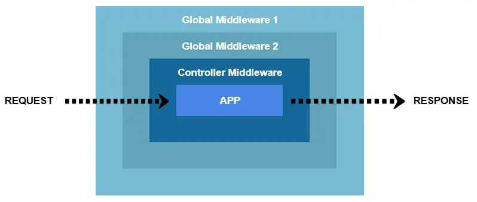

# Middleware

Snappy supports middleware at two levels: **global** middleware applies to all endpoints and **controller-specific** middleware that runs only for targeted controllers.

Middleware is altering the `$callbackValues` both before the request reaches the application and after the response is generated. Details of `$callbackvalues` is explained in this [page](/controller-callback-values)

::: warning :information_source: NOTE
However, the `records` property within `$callbackValues` is available for modification since database fetch result already done.
:::

Middleware works like layers of an onion skin that can be illustrated as follows:



## Creating middleware:

1. Define `namespace Middleware`
2. Define `use Core\Middleware`
3. Create class name and extends your class from `Middleware`
4. Save it with the same class name under middleware directory

:bulb: **Usage**

::: tip get value from `$callbackValues`

```php
$this::getData(string $key): mixed;
```

**`key`**

&emsp; A dot notation (e.g: `data.name.last`)

:::

::: tip set value to `$callbackValues`

```php
$this::setData(string $key, mixed $value): mixed;
```

**`key`**

&emsp; A dot notation (e.g: `keys.last`)

**`value`**

&emsp; Value to be set

:::

Snappy middleware requires corresponding request method -like Controller - to be executed

::: tip GET method handler

```php
public function get(string $sequence): void
```

:::

::: tip POST method handler

```php
public function post(string $sequence): void
```

:::

::: tip DELETE method handler

```php
public function delete(string $sequence): void
```

:::

::: tip PUT method handler

```php
public function put(string $sequence): void
```

:::

::: tip PATCH method handler

```php
public function patch(string $sequence): void
```

:::

::: warning :information_source: NOTE
`sequence` value in middleware's request method only has `before` or `after` indicates before/after reaching controller
:::

## Global

Global middleware runs on all endpoints and suitable for Logger, Authentication and any process required for every request & response from the endpoint.

_Example below related to `$callbackValues` explained in [here](/controller-callback-values)_

```php
// middleware/yourmiddleware.php

namespace Middleware;
use Core\Middleware;

class YourMiddleware extends Middleware{
   public function get($sequence){
      if ($sequence == "before"){
        // change "last" parameter value of "keys" section to Wick
        $this::setData("keys.last", "Wick");
        //other logic before middleware reaches app
      }else{
        //other logic after middleware reaches app
      }
   }
}
```

Register your global middleware in `config/middleware.php`

```php
return ["Middleware1", "Middleware2", "MiddlewareN"];
```

## Controller-specific

Controller-specific middleware in Snappy is designed to run only for a particular controller, giving you precise control over the request lifecycle and logic flow for specific endpoints.

Unlike global middleware that applies to all routes and controllers, controller-specific middleware is executed only when the associated controller is invoked. This is especially useful for applying logic like access control, validation, or transformation that's relevant only to a particular module or feature.

**How It Works**

To define a controller-specific middleware, simply create a file under the `src/middleware/` directory that matches the controller file name, Snappy will automatically detect and execute this middleware when controller is accessed. For example, if you have a controller named `Examples`, the corresponding middleware file should be: `src/middleware/examples.php`

Usage:

```php
// middleware/yourcontrollername.php

namespace Middleware;
use Core\Middleware;

class YourControllerName extends Middleware{
   public function get($sequence){
      if ($sequence == "before"){
          //do something before middleware reaches app
      }else{
         //do something after middleware reaches app
      }
   }
}
```

::: warning :information_source: NOTE
No need to register your controller-specific middleware in `config/middleware.php`
:::
